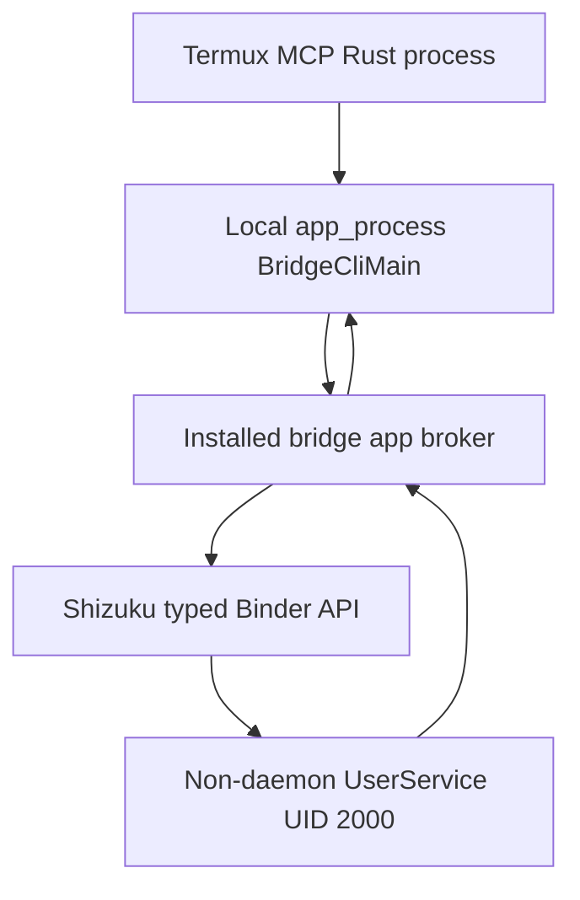

# Shizuku typed bridge architecture and threat model

Status: proposed architecture contract. This document freezes the first
reviewable design boundary; it does not claim that the bridge, its APK, a
physical-device gate, or a release-qualified Android control plane exists.

Normative words such as **must**, **must not**, **required**, and **blocked**
are implementation and release requirements.

## Decision summary

The production path will be a PackageManager-installed companion APK with the
fixed application ID:

```text
io.github.cyberbasslord666.termuxmcpedge.bridge
```

The first implementation is read-only. It may eventually provide only:

- typed Shizuku/server and UserService UID observations; and
- a future fixed, no-argument `android_system_features` read, returning only a
  separately reviewed closed set of boolean fields.

Neither surface exists on the current branch. In particular,
`android_system_features` is a proposed first typed read, not a reinterpretation
of the existing `android_rish_status` diagnostic or a current release promise.

It does not authorize a mutation, raw Binder transaction, caller-selected
Android service, command, executable, argv, environment, stdin, package name,
feature name, path, or raw framework output. The existing `android-rish`
posture remains a development diagnostic and is not the production transport.

In Stage 4 and later, the local ART loader must prefer a read-only descriptor
opened directly on the PackageManager-installed, non-Termux-owned `base.apk`.
The child must load that exact descriptor through `/proc/self/fd/3`. Stage 3
does not claim or test that installed-code provenance boundary: it admits only
the harness-created fixture descriptor defined below and proves only local
descriptor, supervisor, and frame mechanics. No stage may copy an APK or DEX
into Termux storage or a sealed memfd as a compatibility fallback. If the
stage-specific APK cannot be opened with its required admission checks, or ART
cannot load the inherited descriptor on an observed target, the bridge is
unavailable.

## Authority and trust boundary

The target privileged identity is adb-started Shizuku's Android shell UID
`2000`. UID `0`, UID `1000`, Sui/root mode, and every other identity fail
closed. AOSP defines shell and system as distinct identities in the
[Android 16 filesystem identity registry](https://github.com/aosp-mirror/platform_system_core/blob/android-16.0.0_r1/libcutils/include/private/android_filesystem_config.h).

The trusted computing base for the read-only design is:

- the Android kernel, SELinux policy, PackageManager, and package installer;
- the exact installed bridge APK and its pinned current release signing
  certificate;
- the exact inventoried Shizuku manager APK and every UID-`2000`/shell-domain
  process capable of supplying, replacing, or impersonating its Binder;
- the reviewed Termux MCP binary, configuration, and descriptor supervisor;
- the protected external-manifest and installation-enrollment signing
  authorities and their pinned public keys;
- the protected controller that independently measures release evidence.

A root/system compromise, compromised release-signing key, malicious Android
firmware, or malicious Shizuku build signed by an approved key is outside the
claim. Those conditions can subvert PackageManager, Binder, or the installed
bytes below this bridge.

The stock Shizuku provider transport does not cryptographically bind the
received Binder to the installed manager APK, its signing certificate, or its
process. PackageManager checks on the manager are compatibility and inventory
checks only. `Shizuku.getUid()` is a value reported by that Binder, while
`Os.getuid()` is an observation from the process launched as the UserService;
neither proves which manager APK supplied the Binder. Consequently, all
UID-`2000`/shell-domain processes that can inject or replace that Binder are in
the runtime trusted computing base. This ADR claims only two typed UID
observations that must both equal `2000`, not cryptographic manager identity or
exclusive Binder provenance.

The Termux application UID is trusted for availability and for requesting the
allowlisted reads. Another process with the same UID can stop the server,
change its configuration, race its requests, and impersonate the Termux-side
caller. Therefore the initial claim is read-only and does not claim resistance
to a compromised same-Termux-UID process. A later mutation design is blocked
until grant signing, durable replay state, emergency stop, protected-target
policy, and exact-parameter confirmation live in the companion application's
separate UID, or the operator explicitly accepts the weaker whole-Termux-UID
trust model in a new threat-model revision.

## Process and Binder topology



The steps are:

The full sequence below is the eventual Stage-4-and-later topology. Stage 3
performs only the descriptor launch in step 1 followed by the authority-free
local probe defined below; it must not enter step 2 or contact the installed
application process.

1. In Stage 3, Rust opens and pins only the exact harness-created fixture
   `base.apk` admitted by `Stage3DirectTestAdmissionV1`, then starts the fixed
   authority-free `BridgeCliMain` class from that inherited read-only
   descriptor. In Stage 4 and later, Rust instead opens and pins the exact
   PackageManager-installed bridge `base.apk` and starts the later fixed local
   class from that installed read-only descriptor.
2. `BridgeCliMain`, running under the Termux UID, sends an explicit-package
   bootstrap broadcast to the fixed bridge application ID. The only supplied
   object is a typed AIDL callback Binder and fixed protocol metadata.
3. The installed bridge app returns an `IBridgeBroker` Binder through that
   callback. Every broker method rechecks the Binder calling UID, the enrolled
   Termux package, and the enrolled Termux signing certificate.
4. The bridge app obtains and monitors Shizuku through `ShizukuProvider`. It
   checks permission and Binder liveness. Before each accepted read it also
   requires the exact manager package, version code/name, installed base-APK
   SHA-256, current signer SHA-256, `Shizuku.getVersion() == 13`,
   `Shizuku.getServerPatchVersion() == 6`, and reported UID `2000` against its
   compile-time manager pins. It returns those closed observations and the
   compile-time manager-policy digest to Rust, which alone verifies and
   enforces the external signed manifest. These are compatibility/inventory
   and typed observation checks, not Binder-to-APK authentication.
5. The broker creates a fresh private broker-generation secret, a fresh
   `UserServiceArgs.tag`, and a never-reused service-generation `version`, then
   binds a non-daemon typed UserService from its own installed APK. The service
   accepts exactly one initialization for that install/broker generation,
   returns a fresh service-instance nonce, and refuses reinitialization. Every
   later AIDL method carries that generation tuple. On initialization and on
   every method, the service resolves the current installed bridge-app UID and
   requires `Binder.getCallingUid()` to equal it, so the Termux CLI cannot call
   the privileged service directly. The service returns its own `Os.getuid()`
   through a closed AIDL result; only the exact value `2000` is accepted.
6. The result returns through typed Binder callbacks. `BridgeCliMain` emits one
   bounded local protocol frame; Rust rejects missing, duplicate, malformed,
   extra, or trailing bytes and requires empty stderr and a successful local
   child exit.

Shizuku's server validates that a requested UserService component belongs to
the Binder caller's app ID and resolves that installed package's
`applicationInfo.sourceDir` before creating the service, as shown in the
[official UserService manager](https://github.com/RikkaApps/Shizuku-API/blob/a27f6e4151ba7b39965ca47edb2bf0aeed7102e5/server-shared/src/main/java/rikka/shizuku/server/UserServiceManager.java).
The Shizuku implementation then launches its service starter with the manager
APK as the ART classpath and loads the requested service from the installed app
source, as shown by
[ShizukuUserServiceManager](https://github.com/RikkaApps/Shizuku/blob/b844bc491f1790c72328e1a8e5b2349f8978f0ea/server/src/main/java/rikka/shizuku/server/ShizukuUserServiceManager.java)
and
[ServiceStarter](https://github.com/RikkaApps/Shizuku/blob/b844bc491f1790c72328e1a8e5b2349f8978f0ea/starter/src/main/java/moe/shizuku/starter/ServiceStarter.java).
The bridge app, rather than a Termux-side process, must therefore own the
UserService component and make the Shizuku bind.

The official manager can retain a live UserService record for a matching
package, class/tag, and service version, as its
[`createUserServiceRecordIfNeededLocked`](https://github.com/RikkaApps/Shizuku-API/blob/a27f6e4151ba7b39965ca47edb2bf0aeed7102e5/server-shared/src/main/java/rikka/shizuku/server/UserServiceManager.java)
path shows. Compile-time identities cannot detect an identical-byte reinstall
because they remain identical. A fresh tag and service-generation version are
therefore lifecycle inputs, not optional labels; a broker must never reconnect
a new generation to an old record.

The installed Shizuku manager APK cannot replace the bridge APK. Its official
non-app loader can return the Shizuku Binder and load the manager's `Shell`
class, but the official
[`Shell`](https://github.com/RikkaApps/Shizuku/blob/b844bc491f1790c72328e1a8e5b2349f8978f0ea/manager/src/main/java/moe/shizuku/manager/shell/Shell.java)
extends RISH; it does not contain this
repository's closed AIDL contract, broker policy, or UserService. Loading it
would therefore preserve the stdout/stderr and remote-exit defects that the
typed bridge is intended to remove. The separately signed bridge APK is the
smallest PackageManager-owned artifact in which this repository can define and
version those types.

## Android project and AIDL boundary

The proposed implementation tree is:

```text
android/shizuku-bridge/
  settings.gradle.kts
  build.gradle.kts
  gradle.properties
  gradle/libs.versions.toml
  gradle/verification-metadata.xml
  gradle/wrapper/
  bridge-contract/
    build.gradle.kts
    src/main/aidl/io/github/cyberbasslord666/termuxmcpedge/bridge/
  bridge-app/
    build.gradle.kts
    proguard-rules.pro
    src/main/AndroidManifest.xml
    src/main/java/io/github/cyberbasslord666/termuxmcpedge/bridge/
    src/test/
    src/androidTest/
```

`bridge-contract` contains only closed AIDL interfaces and parcelables. The
first version should define:

- `IBridgeBootstrapCallback`, returning only the broker Binder or a stable
  bootstrap failure;
- `IBridgeBroker`, with separate `observeIdentity` and `readSystemFeatures`
  methods;
- `IBridgeIdentityCallback` and `ISystemFeaturesCallback`;
- `IPrivilegedBridge`, with the same two typed reads plus request cancellation;
- fixed `BridgeCallContext`, `BridgeIdentityObservation`,
  `SystemFeaturesResult`, and `BridgeFailure` parcelables.

There is no generic operation code, `Bundle` escape hatch, file descriptor
supplied by a caller, raw `IBinder` transaction method, Android service name,
or untyped byte payload at the privileged boundary. Request IDs and 32-byte
nonces are fixed protocol metadata, not authority. Every array/string has a
small immutable maximum and every parcelable rejects unknown versions.

The protected build generates compile-time constants for `protocolVersion`,
`bridgeBuildId`, `aidlContractSha256`, and `managerPolicySha256`.
`BridgeCliMain`, the broker, and the UserService must each return their own
embedded protocol, build, and AIDL-contract values on every call; the broker
also returns its embedded manager-policy digest and closed installed-manager
observations. Rust embeds its separate `rustBuildId` and the sole external-
manifest verification public key. It loads and verifies a bounded external
release manifest signed by the protected/offline release authority. That
manifest binds the exact Rust ELF and APK digests, current APK signer, Rust and
bridge build IDs, protocol version, AIDL contract and manager-policy digests,
manager package/version/base-APK digest/current signer, exact Shizuku API
major/patch, and ART/device policy.

Java does not receive the external manifest, does not verify its signature,
and must not claim to enforce it. The broker enforces only the exact manager
pins compiled into the signed bridge APK and returns closed observations. Rust
alone verifies and enforces the external signed manifest, requires the broker's
compiled policy digest and observations to match it, and rejects any mismatch.
The manifest digest in `BridgeCallContext` is an opaque correlation value to
the Java layers; echoing it is not manifest authentication.

`BridgeCallContext` carries a fresh Rust-CSPRNG 32-byte request nonce that the
MCP caller cannot supply, plus the signed manifest digest. Every CLI frame,
broker callback, and UserService result must echo that exact nonce plus its
compile-time build ID, protocol version, and contract digest. The request and
all three responses are thereby correlated to the exact manifest digest that
Rust has already verified; the Java echo does not verify the signature. Rust
requires all three Java observations and its own constants to match the
verified manifest and the request. A self-asserted build ID, an echoed nonce
without Rust's verified-manifest match, or equality between only two layers is
not provenance.

### Install and service generations

Compile-time identity is insufficient for an identical-byte `adb install -r`.
The bridge app must maintain a random `installGeneration` identifier in
non-backup app-private storage and rotate it after every observed package
replacement, including `MY_PACKAGE_REPLACED`, before serving a broker. Startup
must also reconcile PackageManager `lastUpdateTime`, current `sourceDir`
identity, and the persisted replacement record; ambiguity or a missed update
signal is a hard failure rather than permission to reuse the generation. The
relevant platform inputs are the official
[`ACTION_MY_PACKAGE_REPLACED`](https://developer.android.com/reference/android/content/Intent#ACTION_MY_PACKAGE_REPLACED)
and [`PackageInfo.lastUpdateTime`](https://developer.android.com/reference/android/content/pm/PackageInfo#lastUpdateTime)
contracts; their ordering and reliability on each supported OEM profile still
require physical qualification.

After each install or reinstall, a protected controller must obtain that
generation through the visible enrollment flow and create a bounded signed
installation-enrollment record. The record binds the release-manifest digest,
device slot, application ID, install generation, PackageManager install/update
times, installed source descriptor identity and digest, current signer, and
compile-time protocol/build/contract/policy identities. Rust verifies this
record with its pinned enrollment-authority public key and requires every
runtime observation to match it. The bridge app does not verify this external
record; it returns its current closed observations and generation for Rust to
compare. Reinstall therefore invalidates the old record even when every APK
byte and compile-time identity is unchanged, and re-enrollment is an explicit
protected operation.

For each broker process, the app creates a CSPRNG
`brokerGenerationSecret`, a cryptographically fresh `UserServiceArgs.tag`, and
a never-reused service-generation `version`. The version is allocated from a
persisted, monotonically increasing positive-`int` counter scoped to the
current install generation; counter loss, rollback, or exhaustion invalidates
enrollment and fails closed. The cryptographically fresh tag remains required
even when the integer is new. The new UserService's one-time initialization
binds the `installGeneration`, broker secret, and release-manifest digest and
returns a fresh `serviceInstanceNonce`. It permanently refuses a second
initialization, including an attempt by a new broker to make a retained old
service adopt a new generation. Every privileged call must carry and match the
install generation, broker secret, service-instance nonce, request nonce, and
manifest digest. These values are lifecycle freshness, not proof against the
UID-`2000` shell-domain TCB, and none may appear in MCP responses, aggregate
labels, or logs.

The broker must request removal of every prior known UserService record,
unbind on every terminal path, and prove the old process/record cannot answer
the new generation before a result is accepted. The protected physical gate
must exercise an identical signed-APK byte-for-byte reinstall, deliberately
retain the old UserService, verify install-generation rotation and a fresh
tag/version, and prove the old instance rejects reinitialization and cannot
authorize a call. These update-invalidation mechanics remain future
implementation and physical-evidence requirements.

`bridge-app` contains the bootstrap receiver, broker, minimal permission and
signer-enrollment activity, Shizuku lifecycle owner, installed-package
identity verifier, local `BridgeCliMain`, and non-daemon UserService. The
manifest must be base-only and Java-only, with no dynamic features, native
libraries, `INTERNET`, broad storage, Accessibility, VPN, device-admin,
notification-listener, or package-install permission. Production builds must
be non-debuggable, non-backupable, minified, and signed by the frozen bridge
release key. The bootstrap receiver may be exported only because the Termux
UID must reach it; it accepts no action input and exposes no authority before
the subsequent Binder caller checks.

The Android build has these bounded dependencies:

- exact `dev.rikka.shizuku:api:13.1.5` and
  `dev.rikka.shizuku:provider:13.1.5` artifacts, locked and covered by Gradle
  dependency verification;
- a pinned Gradle wrapper, Android Gradle Plugin, Android SDK package set, and
  JDK, each checked by the Android workflow rather than downloaded implicitly;
- compile-only Android hidden-API stubs plus the pinned compatibility/refine
  layer needed only for the fixed non-app bootstrap and fixed privileged
  framework calls; and
- generated AIDL Java stubs from `bridge-contract`, with no reflection-defined
  protocol.

The dependency coordinates, provider setup, adb-versus-root UID behavior, and
UserService lifecycle come from the official
[Shizuku API guide](https://github.com/RikkaApps/Shizuku-API/blob/a27f6e4151ba7b39965ca47edb2bf0aeed7102e5/README.md).

The official Shizuku shell module uses compile-only hidden stubs and a refine
compatibility layer for its non-app bootstrap, as shown by its
[`shell/build.gradle`](https://github.com/RikkaApps/Shizuku/blob/b844bc491f1790c72328e1a8e5b2349f8978f0ea/shell/build.gradle).
The implementation must pin equivalent inputs rather than copy a built manager
DEX. A custom provider subclass must call
`ShizukuProvider.disableAutomaticSuiInitialization()` before provider
initialization: the bridge supports only adb-started Shizuku and rejects Sui or
any UID-0 server.

Initial compatibility is deliberately narrower than the upstream library:
AArch64 Android API 30 through 36, `/system/bin/app_process64`, Shizuku server
API major `13` with server patch `6`, and only the exact manager version,
base-APK SHA-256, current signer SHA-256, and physical device/OEM profiles named
by the signed manifest and future versioned policy. `SigningInfo` history is
not a substitute for the pinned current signer. Supporting another manager
build, API major/patch, older Android API, 32-bit runtime, or unnamed OEM
profile requires a new compatibility-policy version and physical evidence.
This ADR does not invent the manager artifact values before protected
measurement: an unset version, digest, or current signer makes the bridge
unavailable, and stage 6 must freeze all three exact values with no range or
signing-history fallback.

Android's AIDL guidance requires concurrent Binder calls to be thread-safe and
warns that remote calls can fail, so the implementation must bound concurrency
and handle every death/error path explicitly. See the official
[AIDL guide](https://developer.android.com/develop/background-work/services/aidl)
and [`IBinder.linkToDeath`](https://developer.android.com/reference/android/os/IBinder#linkToDeath(android.os.IBinder.DeathRecipient,%20int)).

## Installed `base.apk` descriptor contract

Android exposes the installed base APK path as
[`ApplicationInfo.sourceDir`](https://developer.android.com/reference/android/content/pm/ApplicationInfo#sourceDir).
The setup/controller records that PackageManager-derived path for the exact
approved package; the MCP caller cannot provide or change it. In Stage 4 and
later, runtime configuration binds the path to the exact expected APK SHA-256,
release signer SHA-256, package name, version code, and version name. Stage 3
has no such runtime configuration and uses only the closed direct-test record
below.

### Admission and descriptor checks

Stages 3 and later share the mechanisms in steps 1 through 6 below. Step 7 has
an explicit Stage-3 descriptor-only branch and a separate Stage-4-and-later
broker branch; Stage 3 must never satisfy a postcheck by entering the later
broker topology.

Stage 3 has exactly one admission source: a crate-private
`Stage3DirectTestAdmissionV1` value constructed inside the Stage-3 unit-test
module. It is not serializable or deserializable, is compiled only under
`cfg(test)`, and has no constructor in the server binary, AppConfig, an MCP
handler, an environment variable, a CLI, or an Android workflow artifact. The
test module itself creates and canonicalizes the temporary fixture root and
`base.apk` path; no test caller supplies a path. It compile-time includes the
exact fixture APK with `include_bytes!` and writes only those bytes to the new
path. No runtime build output, workflow artifact, path, or byte payload can
supply the fixture. The record contains exactly:

- record version `1`;
- the harness-created canonical fixture root and `base.apk` path;
- the expected fixture byte length and raw SHA-256 from the checked-in fixture
  manifest;
- the harness-set and then independently observed UID, GID, mode, and link
  count, plus the opened descriptor's observed device/inode/timestamps;
- the raw SHA-256 of one exact ordered test-only ART-environment pair list and
  that closed list; and
- one nonzero raw SHA-256 fixture-manifest commitment, used only as the opaque
  `manifestDigest` echo.

The checked-in environment-pair inventory is included in the frozen Stage-3
Rust source manifest. The checked-in fixture manifest is deliberately excluded
from both source manifests and from the AIDL closure: its APK digest cannot
contribute to `rustBuildDigest`, `cliBuildDigest`, or `aidlDigest`, because the
APK embeds those three earlier commitments. Instead, the documentation/build
contract byte-closes the fixture-APK and fixture-manifest paths and the
manifest schema separately, builds the constants-bearing APK first, and then
requires the manifest's byte length and raw SHA-256 to equal that exact APK.
The Rust test module uses `include_bytes!` on both the exact APK and the
separately closed manifest. Before writing the included APK bytes, it requires
their length and raw SHA-256 to equal the manifest; it parses only the
manifest's fixed fields into `Stage3DirectTestAdmissionV1` and hashes the exact
manifest bytes for the opaque `manifestDigest` echo. It never accepts a runtime
APK or manifest path, or runtime APK or manifest bytes.

Dynamic path and descriptor facts are created and observed only inside the
same test, then reconciled before and after the child. They are never read from
a file, process environment, test argument, or operator input. Test-only
owner/mode and environment values do not qualify an installed APK, release
identity, or physical ART profile. Stage 3 can therefore prove only
descriptor/supervisor/frame mechanics. Stage 4 must delete or make unreachable
the test-only constructor in non-test builds and introduce a separate
production admission constructor whose inputs come only from verified
signed-release-manifest, protected PackageManager/controller, runtime
configuration, and versioned physical-policy records; it may not reinterpret
or promote the Stage-3 fixture record.

Before every local bridge launch, Rust must:

1. Stage 3 requires an absolute, canonical path beneath the canonical
   harness-created temporary fixture root, ending in `base.apk`, with exact
   root and path equality to `Stage3DirectTestAdmissionV1`. Stage 4 and later
   require an absolute, canonical path beneath the observed PackageManager
   application-code root, ending in the installed `base.apk`. Every stage
   rejects relative paths, lexical aliases, symlinks, and any path inside an
   MCP filesystem safe root.
2. Walk every parent with descriptor-relative, no-follow opens, then open the
   final file `O_RDONLY | O_CLOEXEC | O_NOFOLLOW`. The resulting access mode
   must be read-only. A separate write-open attempt by the Termux UID must fail.
3. Require one regular file and record its device, inode, owner UID/GID, mode,
   link count, size, mtime, and ctime. A Stage-3 direct test requires exact
   equality to its test-only record and a link count of one, but that same-UID
   fixture is never an installed-code or immutability claim. In Stage 4 and
   later, the owner must not be the Termux UID, the link count must be one, and
   no accepted mode may grant write access to the Termux UID. The exact
   production owner/group/mode tuple is not guessed by this ADR: it must be
   measured on the supported physical profile and frozen in the versioned
   physical policy before production enablement.
4. Require the pathname immediately before launch to resolve to the same
   device/inode as the descriptor. Hash only the descriptor, within a fixed APK
   size ceiling. A Stage-3 direct test requires equality to the closed fixture
   digest in `Stage3DirectTestAdmissionV1`; Stage 4 and later require equality
   to the verified release manifest. Require unchanged descriptor metadata
   before and after hashing.
5. The installed-APK executor must not use `BoundedProcess`,
   `std::process::Command`, or `tokio::process::Command`. Those launchers own
   implementation-private exec-error and child-side stdio descriptors; their
   numbers are not available to this contract, and one may occupy or be
   clobbered by FD 3. Stage 3 instead requires a dedicated FD-aware low-level
   fork/exec supervisor whose complete child descriptor setup is project-owned
   and adversarially tested.

   Before `fork`, that supervisor duplicates six child source endpoints
   to distinct descriptors numbered 5 or greater, all with `CLOEXEC`: bounded
   request input (or `/dev/null`), bounded stdout, bounded stderr, the already
   validated read-only APK, and the write end of one private child-to-parent
   exec-status pipe, plus the read end of one private parent-to-child release
   pipe. The parent records its own process group before `fork`.
   The returned child PID is the only accepted child identity and the only
   possible child process-group ID; neither value is read from output, a file,
   or caller input.

   In the child, using only async-signal-safe syscalls, the first setup action
   is `setpgid(0, 0)`. It must establish a new child-owned process group whose
   PGID equals the fork-returned child PID. Failure writes a fixed bounded
   process-group setup-error record through the private status source and calls
   `_exit`. After successful `setpgid`, the child closes every known inherited
   parent-side endpoint while retaining only the six high-numbered child-source
   descriptors: the request writer when present, stdout reader, stderr reader,
   exec-status reader, parent-release writer, and original parent APK
   descriptor are all closed in the child. In particular, the child's inherited
   release-writer copy must close before its first gate read so parent closure
   can produce authoritative EOF. Any close failure is a fixed setup error.
   Unknown inherited descriptors remain untouched until the later fail-closed
   `close_range`; none is used by the barrier protocol.

   The child then blocks on an exact one-byte parent-release gate before
   descriptor remapping, ART execution, or any operation that can create a
   descendant. EOF, an unexpected byte, a short or failed read, or a second
   byte is a fixed setup error followed by `_exit`.

   The parent immediately makes the idempotent
   `setpgid(childPid, childPid)` call to close the fork race, then requires
   `getpgid(childPid) == childPid` and `childPid` unequal to the recorded caller
   PGID. An `EACCES`/race result is acceptable only when that exact `getpgid`
   check succeeds; every other result closes the release writer without a byte
   and fails closed. Until exact PGID confirmation, cleanup may signal only the
   positive direct-child PID while the child remains gated. Immediately after
   confirmation, the parent irreversibly switches cleanup to the confirmed
   negative child PGID; every later cleanup signal uses that group whether or
   not the release byte has been written or consumed. Only after recording that
   transition does the parent write the single fixed release byte and close its
   writer; that write and close are themselves required to succeed. The barrier
   guarantees that the pre-confirmation path cannot contain an exec'd ART
   process or descendant.

   After consuming the release byte, the child closes the release reader and
   maps the other five sources to FDs `0`,
   `1`, `2`, `3`, and `4` respectively,
   leaves `CLOEXEC` set only on FD 4, verifies FD 3 against the admitted APK,
   and closes every descriptor numbered 5 or greater with one fail-closed
   `close_range` operation before `execve`. Unsupported or failed
   `close_range` has no scanning or launcher fallback: the child reports a
   fixed bounded setup-error record on FD 4 and calls `_exit`.

   Immediately after a successful `fork`, the parent closes every duplicated
   child-only endpoint on every path: the child's stdin source, stdout writer,
   stderr writer, APK duplicate, exec-status writer, and release reader. The parent retains
   only its request writer when applicable, the stdout and stderr readers, the
   exec-status reader, release writer until the gate is resolved, and the
   original admitted read-only APK descriptor.
   A `fork` failure closes both ends of every newly created pipe and every
   duplicate before returning. In particular, no parent copy of the status or
   stdout writer may keep EOF from being authoritative.

   The parent owns one exact cleanup state machine. It keeps the direct child
   unreaped while any process-group signal is possible, so the child PID/PGID
   cannot be reused. Normal or abnormal exit is first observed with
   `waitid(P_PID, childPid, WEXITED | WNOHANG | WNOWAIT)`; that observation must
   not reap the child. Timeout, cancellation, or overflow first closes the
   request writer, sends `SIGTERM` only to the confirmed negative child PGID,
   and allows one fixed bounded grace interval. Before reaping on every path,
   including after an already-observed normal direct-child exit, the parent
   sends `SIGKILL` to that same confirmed negative PGID so no surviving
   descendant can retain a protocol pipe. It then requires bounded status,
   stdout, and stderr EOF, calls `waitpid(childPid, ...)` exactly once, and
   performs no process-group signal after that reap. A setup failure before
   exact PGID confirmation closes the release writer, uses only positive-PID
   `SIGKILL`, and performs the exact direct-child `waitpid`; the blocked child
   cannot yet have an exec'd ART process or descendant. Any failure after PGID
   confirmation, including a release-byte write or close failure, follows the
   confirmed negative-PGID cleanup path before the exact direct-child reap.

   Any unexpected `setpgid`, `getpgid`, `kill`, `waitid`, `waitpid`, stream
   drain, or deadline result fails the probe. Acceptance additionally requires
   that the WNOWAIT observation and final `waitpid` status agree and report one
   orderly zero exit that occurred before the final group kill. Tests must use
   direct-child and descendant PID witnesses to prove TERM-resistant cleanup,
   cancellation before and after PGID establishment, normal-exit descendant
   cleanup, exact one-time reaping, caller-group survival, and the absence of
   any negative-PGID signal after reap.

   The normalized pre-exec child descriptor set is therefore exactly FDs
   `0` through `4`. FD 3 must be the already validated, admitted read-only APK
   descriptor: the Stage-3 fixture descriptor in a direct test, or the
   Stage-4-and-later installed-APK descriptor. FD 4 is the private `CLOEXEC`
   exec-status writer. Neither FD 4 nor its record is named in argv,
   the environment, or the local protocol. Successful `execve` closes FD 4
   and exposes exactly stdin, stdout, stderr, and FD 3 to ART. EOF on the
   parent status reader means only that no child setup/exec error was reported;
   it is not proof of accepted execution. Acceptance additionally requires
   the one exact Java frame, empty stderr, zero local child exit, complete
   process-group cleanup, and final descriptor/path reconciliation. A setup or
   `execve` error, an unexpected descriptor, a status record, or failure to
   reach status EOF yields no accepted frame. Keep the parent's read-only APK
   descriptor alive until the child is reaped and every request is reconciled.
6. Start only the fixed system runtime and class:

   ```text
   /system/bin/app_process64
     -cp /proc/self/fd/3
     /system/bin
     --nice-name=termux-mcp-bridge-cli
     io.github.cyberbasslord666.termuxmcpedge.bridge.BridgeCliMain
   ```

   AOSP's
   [Android 16 `app_process` argument parser](https://github.com/aosp-mirror/platform_frameworks_base/blob/android-16.0.0_r1/cmds/app_process/app_main.cpp)
   explicitly accepts `-cp`/`-classpath` plus one following argument as VM
   options. The descriptor classpath is therefore an argv pair, not a mutable
   `CLASSPATH` value and not an assumed `-Djava.class.path` alias.

   The dedicated supervisor must construct a new empty `envp` rather than copy
   or enumerate the parent environment. A Stage-3 direct test adds only the
   exact pair list bound by `Stage3DirectTestAdmissionV1`; that is test input,
   not a qualified Android profile. Stage 4 and later add only the exact
   name/value pairs in the signed, versioned ART environment allowlist for the
   selected physical profile. Unlisted variables are absent. `LD_*`, `CLASSPATH`,
   `JAVA_TOOL_OPTIONS`, `_JAVA_OPTIONS`, and `JDK_JAVA_OPTIONS` are forbidden;
   `PATH` is unset and no executable or library is resolved through it. Any
   Android/ART root or boot-classpath variable that a profile actually needs
   has an exact manifest-pinned value and must be physically qualified. The
   [Android 16 runtime startup source](https://github.com/aosp-mirror/platform_frameworks_base/blob/android-16.0.0_r1/core/jni/AndroidRuntime.cpp)
   is the basis for that release's required root variables; it is not assumed
   to define another Android release's allowlist.

   The working directory is exactly `/`. Stdin is `/dev/null` for no-body
   calls or one exact bounded request frame for a method that requires it, then
   closes; no terminal or inherited stdin is allowed. Stdout accepts exactly
   one bounded protocol frame, stderr is bounded and must be empty, and timeout
   or overflow kills the process group and reaps the direct child. The child
   supervisor verifies immediately before `execve` that the open descriptor
   inventory is exactly `0` through `4`, FD 3 is the expected read-only APK,
   FD 4 is the private status writer with `CLOEXEC`, and no descriptor numbered
   5 or greater remains open. After successful exec, only FDs `0`, `1`, `2`,
   and `3` may remain open.
7. After every call, recheck descriptor metadata and pathname identity.
   Stage 3 accepts only its exact authority-free local-probe frame plus that
   descriptor/path postcheck; it obtains no PackageManager or broker
   observation and performs no Binder reconciliation. Stage 4 and later
   additionally require the broker to return commitments to its current
   PackageManager `sourceDir`, installed-package digest, version, and signing
   certificate through the typed identity observation. Rust accepts a later
   typed result only when those private values match the descriptor,
   configured path, and configured release identity. The protected controller
   repeats the comparison from ADB and verifies the APK signature
   independently.

An installed APK is not immutable against the trusted Android system. The
descriptor is safe from a Termux pathname replacement, while PackageManager
and root remain capable of replacing or removing installed code. They are
inside the stated trusted computing base; package-update races still fail
closed as described next.

### Package update and replacement races

An open descriptor remains bound to the opened inode even if PackageManager
later changes the pathname. That prevents ART from silently following a new
Termux-selected file, but it does not authorize a stale bridge version.

- Replacement before open must fail the configured path, inode, version, or
  digest checks.
- Change during hashing must fail the before/after descriptor identity or
  digest checks.
- Replacement after open but before launch leaves the descriptor on the old
  inode; the immediate pathname-to-descriptor comparison must fail.
- Replacement while the child is running may leave the old descriptor
  readable. Its response must still be discarded because the installed
  broker's current PackageManager digest/version, the post-call pathname
  identity, or a Binder death/update generation no longer matches.
- A same-version, identical-byte `adb install -r` must rotate
  `installGeneration` and invalidate the signed installation-enrollment record
  even though APK digest, signer, version, and compile-time identities are
  unchanged; versionCode/versionName or build-ID equality is never enough.
- A retained old UserService remains bound to its prior install/broker/service
  generation tuple and must refuse reinitialization. A new broker uses a fresh
  `UserServiceArgs.tag` and service-generation `version`; an old instance must
  never be accepted merely because its compile-time identity still matches.
- Removal must make the post-call pathname check fail even if the inherited
  old inode remains readable.

The implementation must ensure that no read-only generation, Binder session,
callback, or result survives an APK update, same-version reinstall,
force-stop, uninstall, signer change, Shizuku death, permission revoke, or
server restart. This update invalidation is a future implementation and
physical-evidence requirement, not a property established by this ADR.
Reconfiguration after an approved APK update must record the new
PackageManager path and exact release identity.

### ART compatibility is an evidence gate

Shizuku itself demonstrates that `app_process` can use an APK path as a
classpath in its official
[ServiceStarter command](https://github.com/RikkaApps/Shizuku/blob/b844bc491f1790c72328e1a8e5b2349f8978f0ea/starter/src/main/java/moe/shizuku/starter/ServiceStarter.java).
That does not prove that every Android/OEM ART build permits an application UID
to reopen an inherited installed-APK descriptor through `/proc/self/fd/3`.

The descriptor design is therefore development-only until the exact AArch64
artifact proves on each claimed physical profile that:

- the Termux UID can traverse and read-open the PackageManager path but cannot
  write it;
- the measured owner/group/mode/link tuple matches the committed policy;
- ART loads `BridgeCliMain` from the inherited descriptor with the configured
  path absent from its classpath;
- pathname replacement/removal and package update make the call fail closed;
- the child cannot substitute another descriptor or keep an unreaped process;
- the loaded descriptor digest equals both the release APK and the installed
  broker APK; and
- CLI, broker, and UserService build IDs/protocol/contract digests plus the
  request nonce all match the verified external signed manifest, while Java
  treats its manifest digest only as an opaque correlation value;
- a same-version, identical-byte `adb install -r` rotates
  `installGeneration`, invalidates the signed installation-enrollment record,
  and requires protected re-enrollment;
- a deliberately retained old UserService refuses reinitialization, cannot
  answer a new install/broker/service generation tuple, and is removed and
  reaped before the lane is released;
- the fixed non-app bootstrap can deliver its callback Binder to the installed
  bridge without a background permission request or an OEM-specific fallback;
- the Shizuku v13 package `Context` can execute the fixed public
  `PackageManager.hasSystemFeature` calls in the UserService; and
- the UserService can resolve the current installed bridge-app UID and rejects
  every AIDL method whose Binder caller does not match it; and
- Binder death, permission revoke, bridge update, and Shizuku restart discard
  the in-flight result and require fresh typed identity observations.

If any target denies traversal, read-open, descriptor inheritance, or ART
reopen, the stable outcome is `bridge_installed_apk_descriptor_unavailable`.
There is no copy-to-Termux, copied DEX, memfd, temporary-file, raw-rish, or
localhost fallback in the initial architecture. Any future fallback requires a
new ADR, new threat analysis, a new artifact/evidence schema version, and its
own exact physical qualification.

## Shizuku identity and lifecycle contract

The bridge uses the official typed Shizuku API rather than RISH. The API
exposes the server UID, version, permission state, sticky Binder receipt, and
Binder-death listeners in
[`Shizuku.java`](https://github.com/RikkaApps/Shizuku-API/blob/a27f6e4151ba7b39965ca47edb2bf0aeed7102e5/api/src/main/java/rikka/shizuku/Shizuku.java).
Its official API guide states that adb mode runs the UserService as shell
UID `2000`, root mode runs it as UID `0`, non-daemon mode ties it to the client,
and stopping Shizuku kills the service.

Every read must freshly require:

- the exact manifest-pinned Shizuku manager package, version code/name,
  installed base-APK SHA-256, and current signer SHA-256;
- a live Shizuku Binder reporting exactly API major `13` and server patch `6`;
- Shizuku permission already granted through the companion UI;
- the Binder-reported observation `Shizuku.getUid() == 2000`, without treating
  it as proof of manager provenance;
- a newly bound or live-generation non-daemon UserService reporting
  `Os.getuid() == 2000` and, on each method, requiring
  `Binder.getCallingUid()` to equal the current installed bridge-app UID; and
- a current signed installation-enrollment record matching the bridge's
  `installGeneration` and installed PackageManager observations, verified only
  by Rust; and
- live broker, Shizuku, UserService, and client callback death recipients.

The manager fields above may diagnose an unexpected install and block
compatibility, but they do not remove UID-`2000`/shell-domain Binder injectors
from the runtime trusted computing base.

The bridge must not request permission from a background CLI call. Permission
and Termux-signer enrollment require visible user action in the installed app. A
failure invalidates the generation before returning a stable, non-reflective
reason. No raw exception, package path, signer, Binder identity, process ID,
SELinux label, device identifier, or framework output appears in MCP responses
or aggregate audit labels.

## Local frame and public read contract

Rust and `BridgeCliMain` use a small versioned local frame carried over bounded
stdin/stdout. Stage 3 uses only the exact 152-byte request and 220-byte response
tables below: source-manifest commitments, an opaque unsigned fixture-manifest
commitment, the fixed local-probe method, request ID, nonce, outcome, and three
false authority flags. In Stage 4 and later, a separately reviewed frame adds
the expected CLI build identity, AIDL contract and signed-release-manifest
digests, exact typed result, and nested broker/UserService observations with
their own compile-time identities and the same nonce. Stage 3 has no such
signed-manifest, typed-result, broker, UserService, or Binder completion fields. Unknown
fields/versions, duplicate keys, invalid UTF-8, invalid lengths, extra frames,
stderr bytes, nonzero local exit, timeout, cancellation, or trailing bytes fail
closed. The Stage-3 lane is one non-queueing permit held through APK validation,
local child cleanup, descriptor/path reconciliation, and direct-child reaping.
Stage 4 and later extend that same hold through Binder completion and callback
death.

### Stage-3 authority-free protocol probe

Stage 3 implements only the closed `LOCAL_PROTOCOL_PROBE` method with method
code `1`. It exists to test descriptor admission, ART launch, exact framing,
timeout/cancellation, and child cleanup. It is not bridge status, does not
observe Android or Shizuku identity, and confers no runtime authority.

Every integer is unsigned big-endian. Every frame starts with this exact
16-byte header; there is no alternate header or variable-length extension:

| Offset | Size | Field | Required value |
|---:|---:|---|---|
| 0 | 8 | magic | ASCII `TMCPBRG1` |
| 8 | 2 | `protocolVersion` | `1` |
| 10 | 1 | `frameKind` | request `1`; response `2` |
| 11 | 1 | `method` | `LOCAL_PROTOCOL_PROBE = 1` |
| 12 | 4 | `bodyLength` | request `136`; response `204` |

The request body is exactly 136 bytes and the complete request frame is
exactly 152 bytes:

| Body offset | Size | Field | Required value |
|---:|---:|---|---|
| 0 | 8 | `requestId` | positive and nonzero |
| 8 | 32 | `nonce` | not all zero |
| 40 | 32 | `manifestDigest` | not all zero; opaque commitment only |
| 72 | 32 | `rustBuildDigest` | exact compiled-in Stage-3 Rust source-manifest digest |
| 104 | 32 | `aidlDigest` | exact compiled-in canonical AIDL-closure digest |

The response body is exactly 204 bytes and the complete response frame is
exactly 220 bytes:

| Body offset | Size | Field | Required value |
|---:|---:|---|---|
| 0 | 136 | request echo | byte-exact request body |
| 136 | 32 | `cliBuildDigest` | exact Rust-expected Stage-3 CLI source-manifest digest |
| 168 | 32 | `cliAidlDigest` | byte-equal request `aidlDigest` and embedded canonical AIDL-closure digest |
| 200 | 1 | `outcome` | success `0` |
| 201 | 1 | `runtimeAuthorityEnabled` | `0` (false) |
| 202 | 1 | `shizukuLinked` | `0` (false) |
| 203 | 1 | `binderBootstrapEnabled` | `0` (false) |

Every digest in these tables is the raw 32-byte output of SHA-256, never hex
text. The canonical AIDL closure is the byte string formed from the ASCII
header `TMCP-AIDL-CLOSURE-V1\n`, followed by each of the exact nine tracked
Stage-3 `.aidl` files in unsigned bytewise repository-path order. Each entry is
one unsigned big-endian 32-bit path length, the exact UTF-8 repository-relative
path bytes, one unsigned big-endian 64-bit file length, and the exact file
bytes. The documentation/build contract freezes the nine-path inventory and
recomputes this stream. Rust and `BridgeCliMain` embed the same resulting
digest; Rust sends it as `aidlDigest`, Java rejects any mismatch, Java returns
it as `cliAidlDigest`, and Rust requires all three values to be byte-equal.
Rust likewise sends its exact compiled-in Rust source-manifest digest as
`rustBuildDigest`. `BridgeCliMain` embeds the same expected Rust digest and
rejects byte inequality before producing any response; the byte-exact request
echo then returns that already-validated value to Rust.

Stage 3 also adds two strict checked-in source manifests: one for the closed
Rust executor and one for the closed Java CLI/codec. Each manifest is ASCII
with LF endings, starts with `TMCP-STAGE3-SOURCE-MANIFEST-V1\n`, and then has
exactly one line per frozen source in unsigned bytewise path order:
64 lowercase hexadecimal SHA-256 characters, two ASCII spaces, the
repository-relative path, and LF. Blank lines, comments, duplicate or absolute
paths, `..`, symlinks, unlisted sources, and missing sources are invalid. The
contract freezes both exact path inventories and recomputes every entry.
`rustBuildDigest` is raw SHA-256 of the exact Rust manifest bytes;
`cliBuildDigest` is raw SHA-256 of the exact CLI manifest bytes. Generated
identity-constant files are excluded from their own source manifests to avoid
self-reference and may contain only these recomputed constants. The build
generates identical closed Rust-manifest, CLI-manifest, and AIDL constants for
the sides that compare them. Java holds the expected Rust digest; the Rust
executor holds the expected CLI digest internally, with no operator,
configuration, or MCP override. Java returns its embedded `cliBuildDigest`,
and Rust requires exact byte equality before accepting the probe.

The Stage-3 build graph is strictly acyclic and enforced in this order:

1. Validate the exact Rust and CLI source manifests and canonical AIDL closure,
   then compute `rustBuildDigest`, `cliBuildDigest`, and `aidlDigest`. Neither
   source manifest may list generated identity constants, an APK, the fixture
   manifest, or any artifact-digest file.
2. Generate and embed only those three commitments on the Rust and Java sides.
3. Build the exact fixture APK containing the Java constants.
4. Generate or validate the separately closed fixture manifest from that APK's
   exact byte length and raw SHA-256.
5. Compile the direct Rust test with both the fixture APK and fixture manifest
   included as fixed test data, without feeding either artifact's bytes or APK
   digest back into any source or AIDL commitment.

Thus the dependency direction is source/AIDL commitments to generated
constants to APK to fixture manifest to the test binary/admission. There is no
edge from the fixture APK, fixture manifest, or APK digest back to a source/AIDL
commitment, and no fixed-point or preimage assumption.

The maximum accepted body is 204 bytes and the maximum accepted complete frame
is 220 bytes. Each frame kind has only the exact length above; the Stage-3
codec has no generic or caller-sized body. Wrong magic, version, kind, method,
or length; a zero `requestId`; an all-zero nonce or required digest;
a request-echo mismatch; an unexpected Rust build, CLI build, or AIDL digest;
truncation;
a second frame; any trailing byte; any stderr byte; a nonzero local exit; timeout;
cancellation; child setup/exec failure; or incomplete cleanup fails closed and
returns no accepted probe result.

The Stage-3 `BridgeCliMain` is a plain public `main` class loaded only by the
fixed `app_process64` argv. It is absent from the Android manifest and accepts
zero argv entries. It must not obtain an Android `Context`, call Binder or
PackageManager, link Shizuku, send a broadcast, or instantiate any Stage-4
broker/bootstrap type. Its three authority fields above are always false.
The digest fields are byte commitments for exact local correlation only. In
particular, `manifestDigest` is opaque to Java and its echo is not
signed-manifest parsing, signature verification, provenance, or authorization.

Stage 3 remains an internal, default-disabled development boundary. Rust has
no bridge configuration field, no MCP registration or tool, no status surface,
and no runtime feature wiring for it. Stage-3 tests may invoke the closed
executor directly; wiring configuration or MCP requires a later reviewed
stage.

The proposed public surface remains default-disabled and read-only:

| Surface | Accepted input | Result | Explicitly false |
|---|---|---|---|
| Bridge status | omitted arguments or `{}` | typed server/UserService UID-2000 readiness, with sensitive identity commitments private | root accepted, raw Binder, arbitrary shell, mutation ready |
| `android_system_features` | omitted arguments or `{}` | a future versioned, fixed boolean result only | current availability, caller-selected feature, raw PackageManager output, control authority, mutation ready |

For that first framework read, `IPrivilegedBridge.readSystemFeatures` has no
feature-name argument. The UserService uses only the public
[`PackageManager.hasSystemFeature(String, int)`](https://developer.android.com/reference/android/content/pm/PackageManager#hasSystemFeature(java.lang.String,%20int))
method from the package `Context` supplied by Shizuku v13 for an ordered
allowlist compiled into the signed APK. This deliberately avoids shipping a
private `IPackageManager` AIDL stub whose transaction layout could differ
between Android releases. The result parcelable has one named boolean per
reviewed field, not a map or list. An unavailable/nonfunctional UserService
`Context`, service death, unknown Android API, or partial result invalidates the
entire call; the physical gate must prove this public call on every claimed
profile before the read is exposed.

If `android_system_features` is added, it must have exactly one backend
provider. During migration, enabling both a RISH experiment and the typed
bridge provider is a startup error. After typed physical qualification, the
production provider is the bridge; RISH remains separately named, separately
built, development-only diagnostic surface. No alias may make one backend
silently fall back to the other.

## Rust modules, packaging, and evidence

The Rust implementation should keep the bridge boundary out of
`mcp_transport.rs` and use these review-sized modules:

```text
src/shizuku_bridge/
  mod.rs              # closed client API and stable private failures
  installed_apk.rs    # descriptor walk, identity, hashing, postchecks
  child.rs            # fixed app_process process group and reaping
  frame.rs            # bounded local request/result codec
  status.rs           # typed identity/lifecycle state, no raw evidence
  system_features.rs  # future fixed read only
tests/shizuku_bridge_*.rs
tests/fixtures/shizuku_bridge/
```

A future default-off Cargo feature such as `android-shizuku-bridge` may reuse
the repository's existing `rustix`, `sha2`, Tokio synchronization/time, and
reviewed bounded-limit/error utilities. The installed-APK executor must not
reuse `BoundedProcess` or any standard/Tokio process-spawn, stdio, or exec
setup; only the dedicated FD-aware supervisor creates its child. It must not
reuse `rish_backend` as a transport abstraction.
The only API initially visible to MCP wiring is a no-input status read; the
first framework read is added in its own pull request. Neither accepts a path,
descriptor, package, field name, Android service, opcode, or opaque payload.

The Android workflow initially emits only short-lived development artifacts:

- JVM unit-test outputs and an ephemeral CI-signed APK for emulator checks;
- an exact development-signed universal base APK for the protected physical
  lane;
- dependency-lock, AIDL-source, manifest, R8, APK-content, and signing reports;
  and
- a closed development evidence record with `releaseEligible:false` and
  `productionControlQualified:false`, plus
  `managerBinderCryptographicallyBound:false`, `uidObservationOnly:true`, and
  `shellDomainBinderInjectorsInTcb:true`. It must also state that Rust alone
  verified the external manifest, identify the signed installation-enrollment
  schema, and commit to only non-secret hashes of the install/broker/service
  generation observations.

Those artifacts use bridge-specific development schema names and versions;
they are not appended to current release arrays. Stage 6 should introduce new
development-only policy/evidence schemas. Stage 7 should introduce distinct
production-qualification schema versions for the signed APK. Only stage 8 may
propose new versions of the release policy, Android artifact manifest,
qualification bundle, staging manifest, and public-asset inventory. CI must
prove each schema rejects unknown fields, digest/signer/path drift, missing
cleanup, unqualified device profiles, `releaseEligible:true` in a development
record, and attempts to inherit evidence across APK or policy changes.

## Rejected alternatives

| Alternative | Why it is not the initial production path |
|---|---|
| Stock RISH or the manager APK's `Shell` class | The fixed RISH implementation starts competing readers on one stdout pipe and does not preserve a trustworthy remote exit result; it also has no project-owned typed method boundary. |
| Copy the bridge APK/DEX into Termux storage | Any process sharing the Termux UID can replace or reopen the copied pathname between validation and ART loading. |
| Copy into a sealed memfd | A prior operator-local, non-qualification observation reported `EACCES` when reopening one sealed memfd through `/proc/self/fd/N`. That unqualified observation motivates not depending on this fallback; it is not bridge physical evidence or a general Android claim. Copying also moves provenance away from PackageManager's installed artifact. |
| Private `O_TMPFILE` or mode-`0400` snapshot | It may make ART loading work, but it remains a same-Termux-UID copy and cannot supply the stronger installed-package provenance boundary. |
| Generic Binder proxy | A service/opcode/parcel escape hatch exposes authority larger than the reviewed operation and makes stable schema enforcement impossible. |
| Localhost or abstract-socket broker | It adds another unauthenticated or same-UID endpoint and loses Binder caller/death semantics; it is not a fallback for failed installed-APK loading. |

## Threats and required disposition

| Threat | Required disposition |
|---|---|
| Termux replaces a loader file or path | In Stage 4 and later, no Termux loader file exists and production executes only the pinned installed-APK descriptor. The Stage-3 harness-created fixture is test-only and authority-free; its same-UID mutability is mechanics-test input, not installed-code provenance. |
| PackageManager updates/removes the APK during a call | Descriptor/path/broker identity or death generation changes; discard the result and require reconfiguration. |
| Another app invokes the exported bootstrap receiver | It receives no authority; every broker transaction verifies the Binder caller UID, package, and enrolled signer. |
| A shell-domain process injects a Shizuku Binder | It is inside the stated runtime TCB; manager inventory checks do not authenticate the Binder, and public status reports only the two UID observations. |
| Root/Sui Shizuku supplies more authority | Reject every server or UserService UID other than `2000`. |
| Parent environment or descriptor injection changes ART | A newly constructed empty `envp`, exact signed ART allowlist, absolute executable, fixed `/`, and the dedicated FD-aware supervisor normalize the child to stdio, the validated read-only APK on FD 3, and the private CLOEXEC status writer on FD 4; fail-closed `close_range` removes every higher descriptor, and successful exec retains only FDs 0/1/2/3. |
| Same-version reinstall or retained old UserService | Rotate `installGeneration`, invalidate and re-sign the installation-enrollment record, use a fresh broker secret plus `UserServiceArgs.tag`/service version, and require one-time service initialization. An old service must refuse the new tuple and be removed/reaped; matching build IDs are insufficient. |
| Stock RISH loses/splits output or exit status | RISH is not in the production path; use typed Binder plus one local supervised frame. |
| Caller requests a raw Binder/system service/command | No such AIDL or Rust method exists. |
| Binder or client dies during work | Death recipient cancels the request, invalidates the generation, and cleanup/reaping completes before the lane is released. |
| Same-Termux-UID attacker requests allowlisted reads | Residual read-only risk is explicit; no mutation key or replay authority is in Termux. |
| Same-Termux-UID attacker attempts future mutation | Mutation remains blocked pending companion-UID authorization and a separate reviewed threat-model version. |
| Signing key or trusted Android system is compromised | Outside the claim; rotate/recover out of band and revoke the affected release identity. |

## Reviewable implementation sequence

Stages 1 through 8 are separate pull requests and remain default-disabled until
their own exit gates pass. Stage 9 is a protected post-merge release operation:

1. **Architecture contract:** this document and documentation contract only.
2. **Android skeleton:** pinned Gradle wrapper/dependencies, `bridge-contract`,
   hardened `bridge-app`, inert AIDL, manifest/R8/unit/instrumentation checks;
   no privileged method.
3. **Installed-APK descriptor executor:** Rust descriptor admission,
   `/proc/self/fd/3` ART launcher, the exact authority-free
   `LOCAL_PROTOCOL_PROBE` frame above, cancellation and adversarial fixtures;
   `BridgeCliMain` has no Android/Binder/Shizuku access and Rust has no
   configuration or MCP wiring.
4. **Typed UID observations:** bootstrap callback, caller/signer policy,
   `ShizukuProvider` lifecycle, signed install enrollment, one-time
   install/broker/service generations, non-daemon UserService, and
   development-only bridge status.
5. **First typed read:** fixed system-feature AIDL/result and mutually exclusive
   migration from the RISH development provider.
6. **Development physical gate:** exact development APK and Rust binary,
   protected controller, closed policy/evidence, lifecycle/update/adversarial
   cases; evidence remains non-release and non-production.
7. **Pre-integration production rehearsal:** protected/offline signing of the
   exact candidate, installed-package proof, exact signed-byte physical
   qualification, and disjoint review. This evidence authorizes only the
   release-integration review; it cannot qualify a later merged commit.
8. **Release integration:** only after stage 7, add a new governed feature
   posture/full-suite membership, new release policy/evidence/staging schema
   versions, version bump, and exact-head CI/Security/Android. Merge those
   changes without staging, tagging, or publishing.
9. **Post-merge exact-main qualification and release:** freeze the exact current
   `main` commit after release integration merges; rebuild and repeat protected
   signing, installed-package proof, production physical qualification,
   exact-head CI/Security/Android, and disjoint final review against that commit.
   Keep `main` frozen through staging, annotated tag creation, draft upload,
   final checks, and immutable publication. Any `main` change invalidates the
   run and restarts stage 9 from signing.

## Release and evidence versioning

This ADR leaves exactly seven governed Android postures, exactly nine workflow
artifacts, exactly twelve staged qualification members, and exactly sixteen
public assets unchanged. It does not change Cargo features, `full-suite`, any
release policy, or any current schema.

Development bridge artifacts must declare `releaseEligible:false` and
`productionControlQualified:false` outside those inventories. Production
promotion must add new schema and policy versions with new exact inventories;
it must preserve every existing versioned document and must not reinterpret or
loosen any of them, including all current v1/v2 policies, schemas, manifests,
and evidence. Exact physical evidence binds the Rust binary, signed APK,
current APK signer, installed base APK, AIDL source and contract digests,
compile-time build IDs, signed external manifest, Cargo/Gradle locks, policy,
signed installation-enrollment record, workflow, commit, device profile, and
Shizuku/Termux signers. An APK digest, signing identity, AIDL, bridge source,
descriptor policy, install generation, or lifecycle change requires new
physical evidence rather than inheritance from an older APK.

## User and administrator prerequisites

Before development physical qualification, the operator must:

- provide a dedicated non-personal AArch64 Android device and protected
  controller with ADB and Termux transport;
- install the exact development bridge APK through PackageManager;
- complete the visible install-enrollment flow after every install/reinstall so
  the protected controller can obtain the new `installGeneration` and request
  a signed installation-enrollment record;
- install the exact manifest-pinned Shizuku manager version/base APK/current
  signer, run its adb-started service, open the bridge UI, enroll the observed
  Termux package signer, and grant Shizuku permission;
- participate in deny/grant/revoke, Shizuku stop/restart, bridge
  force-stop/update/remove, and device-reboot scenarios;
- provision durable device-slot quarantine state and an out-of-band reset
  procedure.

Before production signing or release, administrators must additionally:

- freeze the application ID above and create one long-lived bridge release
  keystore whose certificate fingerprint is published and pinned;
- provision a separate protected manifest-signing authority whose public key
  is pinned by Rust, and protect both private keys outside the repository;
  signing material must never enter pull-request jobs, logs, chat, artifacts,
  or device evidence;
- provision a protected installation-enrollment signing authority whose
  public key is pinned by Rust; it may reuse the manifest authority only if the
  protected ceremony explicitly permits per-device enrollment, and its private
  key must never be installed in Termux, the bridge app, or ordinary CI;
- provision a protected or offline signing step that executes no candidate
  code and signs only an independently identified exact-main APK;
- provision disjoint development-physical, production-signing,
  physical-final-review, and final-publication approvals as repository policy
  permits; and
- approve the stage-7 signed APK/device rehearsal before the release feature
  and new inventories merge; then approve the repeated exact-current-main
  signed APK/device evidence after that merge and before any stage, tag, draft,
  or publication action; and
- enforce the stage-9 `main` freeze until immutable publication finishes,
  restarting from protected signing if the commit changes.

If the repository remains under a solo-owner review model, the inability to
obtain disjoint non-author approvals is a recorded governance limitation, not
something the workflow or evidence may describe as satisfied.

## Primary source basis

- Shizuku typed service, UID, permission, Binder receipt/death, and UserService
  API: [`Shizuku.java`](https://github.com/RikkaApps/Shizuku-API/blob/a27f6e4151ba7b39965ca47edb2bf0aeed7102e5/api/src/main/java/rikka/shizuku/Shizuku.java).
- Pinned server API major `13` and patch `6` constants:
  [`ShizukuApiConstants.java`](https://github.com/RikkaApps/Shizuku-API/blob/a27f6e4151ba7b39965ca47edb2bf0aeed7102e5/shared/src/main/java/rikka/shizuku/ShizukuApiConstants.java).
- Shizuku UserService package/app-ID validation and installed `sourceDir`
  selection: [`UserServiceManager.java`](https://github.com/RikkaApps/Shizuku-API/blob/a27f6e4151ba7b39965ca47edb2bf0aeed7102e5/server-shared/src/main/java/rikka/shizuku/server/UserServiceManager.java).
- UserService package-context construction:
  [`UserService.java`](https://github.com/RikkaApps/Shizuku-API/blob/a27f6e4151ba7b39965ca47edb2bf0aeed7102e5/server-shared/src/main/java/rikka/shizuku/server/UserService.java).
- Shizuku installed-APK UserService launch:
  [`ShizukuUserServiceManager.java`](https://github.com/RikkaApps/Shizuku/blob/b844bc491f1790c72328e1a8e5b2349f8978f0ea/server/src/main/java/rikka/shizuku/server/ShizukuUserServiceManager.java)
  and [`ServiceStarter.java`](https://github.com/RikkaApps/Shizuku/blob/b844bc491f1790c72328e1a8e5b2349f8978f0ea/starter/src/main/java/moe/shizuku/starter/ServiceStarter.java).
- Official non-app bootstrap broadcast/Binder callback pattern:
  [`ShizukuShellLoader.java`](https://github.com/RikkaApps/Shizuku/blob/b844bc491f1790c72328e1a8e5b2349f8978f0ea/shell/src/main/java/rikka/shizuku/shell/ShizukuShellLoader.java).
- Manager shell entry point and its build boundary:
  [`Shell.java`](https://github.com/RikkaApps/Shizuku/blob/b844bc491f1790c72328e1a8e5b2349f8978f0ea/manager/src/main/java/moe/shizuku/manager/shell/Shell.java)
  and [`shell/build.gradle`](https://github.com/RikkaApps/Shizuku/blob/b844bc491f1790c72328e1a8e5b2349f8978f0ea/shell/build.gradle).
- Stock RISH terminal implementation, retained only as evidence for why it is
  excluded from production transport:
  [`RishTerminal.java`](https://github.com/RikkaApps/Shizuku-API/blob/a27f6e4151ba7b39965ca47edb2bf0aeed7102e5/rish/src/main/java/rikka/rish/RishTerminal.java).
- AOSP `app_process` VM-option and fixed-class launch parsing:
  [`app_main.cpp`](https://github.com/aosp-mirror/platform_frameworks_base/blob/android-16.0.0_r1/cmds/app_process/app_main.cpp).
- AOSP runtime environment requirements for the pinned Android 16 source:
  [`AndroidRuntime.cpp`](https://github.com/aosp-mirror/platform_frameworks_base/blob/android-16.0.0_r1/core/jni/AndroidRuntime.cpp).
- Android installed base-APK and signing identity:
  [`ApplicationInfo.sourceDir`](https://developer.android.com/reference/android/content/pm/ApplicationInfo#sourceDir),
  [`PackageInfo.signingInfo`](https://developer.android.com/reference/android/content/pm/PackageInfo#signingInfo),
  and the [Android app-signing guide](https://developer.android.com/studio/publish/app-signing).
- Android process isolation boundary: the
  [Android application sandbox](https://source.android.com/docs/security/app-sandbox).
